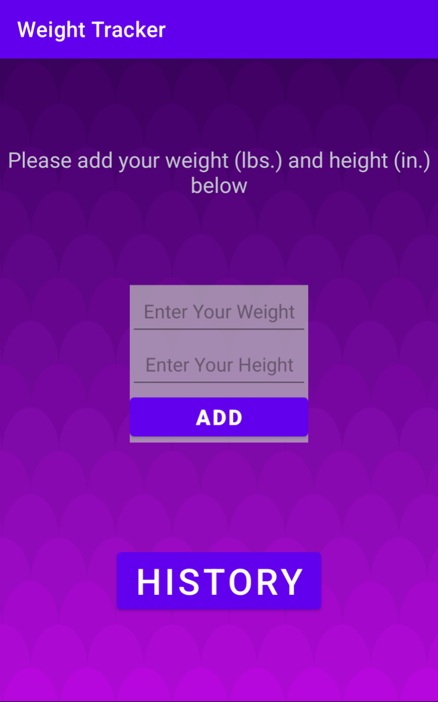
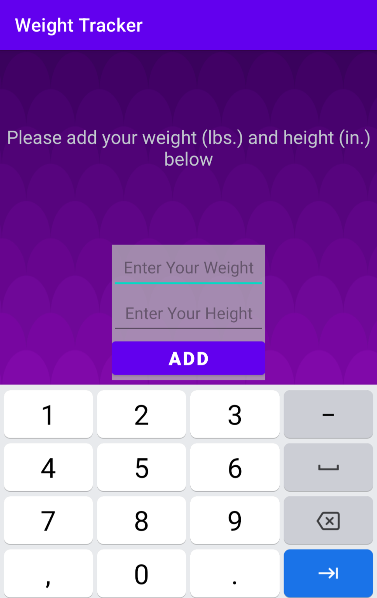
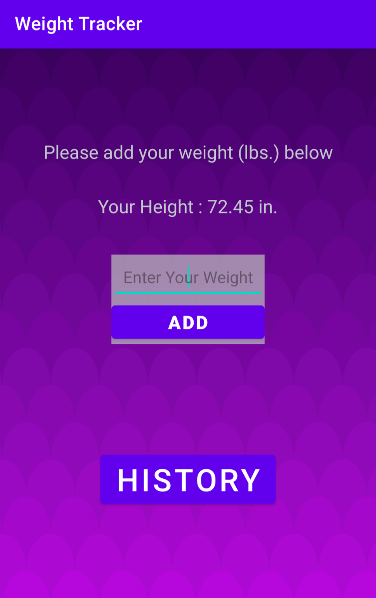
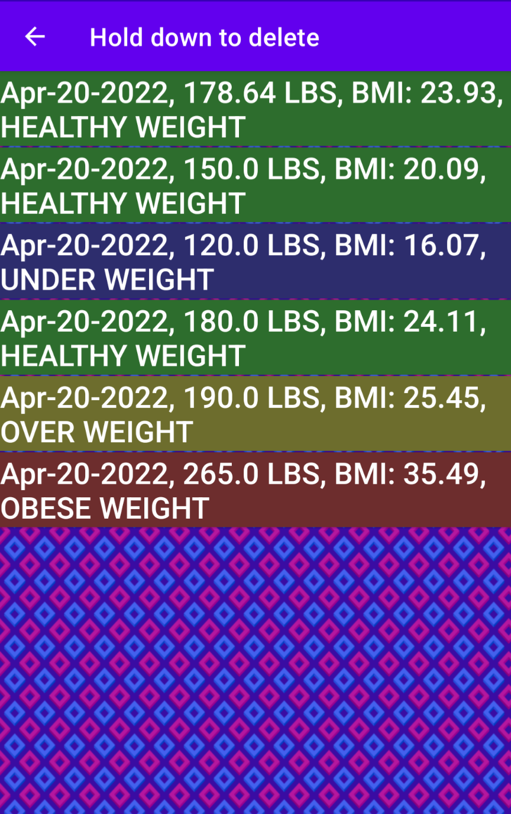

# Weight Tracker

## WeightHistory Class

WeightHistory will be the most important class for this program. It will have 2 classes, a WeightData class, a
WeightViewHolder class and an enum called BMIStatus in it. It will also be the adapter class that is needed
to feed the information to the recycler view for presenting on history view activity. In this class we will have the
main data object, an arraylist that holds WeightData objects
private enum BMIStatus {UNDER, HEALTHY, OVER, OBESE}

### Class data:

- private static final int MAX_DAYS = 365 for maximum number of days assuming one a day
- private static double height for users height assuming it stays same throughout the year 
- private final String fileName for the file name. Can be “myHistory” 
- private final ArrayList<WeightData> history for holding entries 
- private final SimpleDateFormat dateFormat = new SimpleDateFormat ("MMM-dd-yyyy", Locale.US)
for formatting the data that we store to and read from file.

### Methods:

- private ArrayList<WeightData> readFromFile () this function will read the file named fileNamed and return an ArrayList that is populated with data read from file. Even it can’t read anything , it will return a list
- public WeightHistory (Context context) this will be the only constructor for this class, it will receive the context of the application to access applications folder path. Update the fileName using the context
parameter. Read saved data from file. Also, here we can disable editHeight by accessing from context, in case it can read data from filename (means historical data is present).
- public boolean addToHistoryFile it will be overloaded with one and two double parameters. Method with two doubles will be used for initializing the history. First double parameter will be weight, second will be height. Method with a single double parameter (weight) will write the WriteData class to the file, the one with two parameters will do the same but before that it will set the height of the WeightHistory class.
- public void save () this method will write the history array to a file using fileName which we updated in constructor (must have a full path).
- public double getHeight () is a accessor for height

### Methods required by RecyclerViewAdapter interface:

- public WeightViewHolder onCreateViewHolder (ViewGroup parent, int viewType) this method will provide the viewholder class we need below. It will create the custom view using our design and return it.
- public void onBindViewHolder (WeightViewHolder holder, int position) This method provides the data that Recycler view needs. Holder is our custom view class that is used for entries in recycler view and position is the index of that particular data corresponding to it. This is where we format the history items that are presented on recycler view. It will add a long click listener to recognize tap hold gestures for removing individual entries from the history list and finally it will set the background of an entry based on its bmi.
- public int getItemCount () assessor for history’s size

### WeightData Inner Class

This is the class we will use to hold individual weight measurements and their dates.

### Class data:

- private final double weight for holding weight
- private final Date date stores date that entry was created
- private double bmi hold the calculated bmi
- private BMIStatus bmiStatus will hold the enum that will be calculated

### Methods:

- private WeightData (Date date, double weight, double bmi, WeightHistory.BMIStatus bmiStatus) is a private constructor that will create objects after reading data from a history file.
- public WeightData (double weight) this constructor will create an object using current time and weight. Also, it will calculate the BMI and assign it to bmi and using the method below it will set bmiStatus enum 
- private void setBMIStatus () sets bmiStatus enum based on bmi value 
- public String toString () returns a String that includes a formatted date representing the class. Format and sequence are important because the app will try to read it the same way it writes to the file.
### WeightViewHolder Inner Class

Extends RecyclerView.ViewHolder to conform the requirement to be used in recycler view.

### Class data:

- private final TextView weightHistoryEntryText single text view that holds the details of item.
### Methods:

- public WeightViewHolder (View itemView) constructor that takes a view and attaches to the textView
### HistoryViewer Class

Extends AppCompatActivity. This is the activity we will use to display the historical data. We have to add the
class to AndroidManifest.xml with a single line to point at it and it’s parent.
“ <activity android:name=".HistoryViewer" android:parentActivityName=".MainActivity"> </activity>”

### Class data:

- private WeightHistory history
### Methods:

- protected void onCreate(Bundle savedInstanceState) called when the view is about to appear on screen. Attaches the necessary UI elements
- protected void onStop() will be called when the view leaves the screen and it will save changes to the history file on a new thread.
### MainActivity Class

This is the main class of the app (Home).

### Class data:

- private EditText editWeight first text box where the app will receive weight input 
- protected EditText editHeight second text box where the app will receive height input 
- private WeightHistory history object representing our backend model.
### Methods:

- protected void onCreate(Bundle savedInstanceState) will attach all UI elements to corresponding objects. It will change welcome text based on the succession of reading from history, and will add clickListeners for both “ADD” and “HISTORY” buttons. In add listener, it will check for empty inputs and show a Toast in case there is a problem with either text, will transition to history view if successfully adds a weight data to history. History button will just show history.
- private void showHistory() creates an Intent with HistoryViewer class and starts the transition to it.

## GUI

### Data Entry View (Home Screen)
   

### History View

Every entry has a custom color set at creation based on their BMI Status. Holding down a row will remove it
from history.

  
